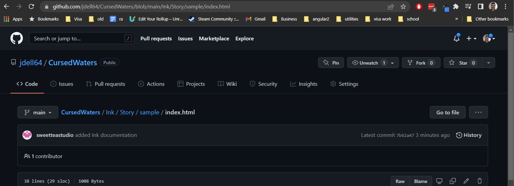
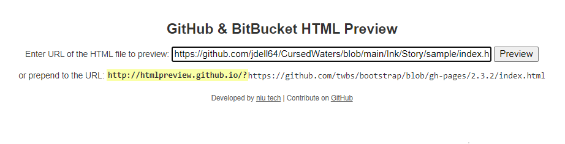
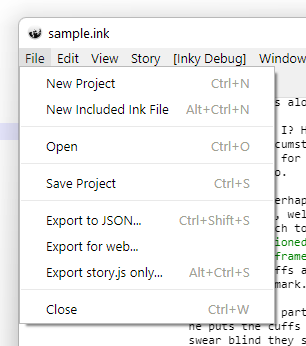

# Cursed Waters Inkle Readme

## How to view in the web

1. Go to https://htmlpreview.github.io/
2. Paste in the path of the index.html file in the repo.

Example:

There is a sample inkle in our cursedwaters project. To view it, I navigated to the index.html page:

I then copied the URL and pasted it in the form on the htmlpreview site:

OR you can just visit this link for the sample:

https://htmlpreview.github.io/?https://github.com/jdell64/CursedWaters/blob/main/Ink/Story/sample/index.html

## How to contribute

1. Write your story using Inky (the thick client of inkle) [Here](https://github.com/inkle/inky/releases). 

2. To make available online (for demos etc) "Export for web":

Save this in "Cursed Waters/Ink/Story." This will create a folder for the web assets.

3. To make available for Unity, "Export to JSON" (same image above).

Save this in "Cursed Waters/Ink/Story." This will create a JSON file that the developers can use. 

